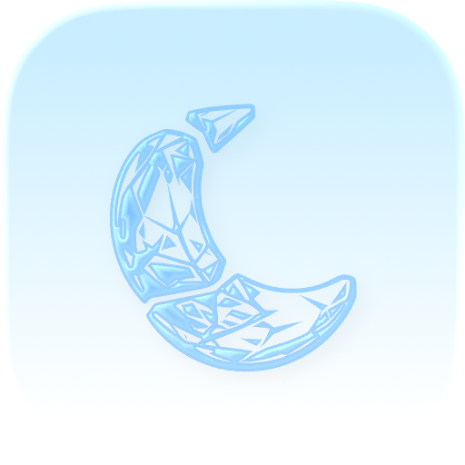
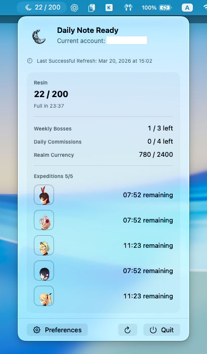

  
  <h3>NotEnoughResins</h3>
  
<em>Track your Genshin Impact account informations on menubar</em>

  
  

## Usage

1. Access [HoYoLab](https://www.hoyolab.com/home) and open devtools (F12)
2. Go to Network tab
3. Open top request named `home`
4. Copy `cookie` which starts with `_HYVUUID=` from Request Headers
5. Open the app preference and paste it

> [!WARNING]
> This app is not signed. You need to allow it to run in `System Settings > Privacy & Security`

## Screenshot

## Note

This app is inspired by [PaimonMenuBar](https://github.com/spencerwooo/PaimonMenuBar)

## License

MIT License
